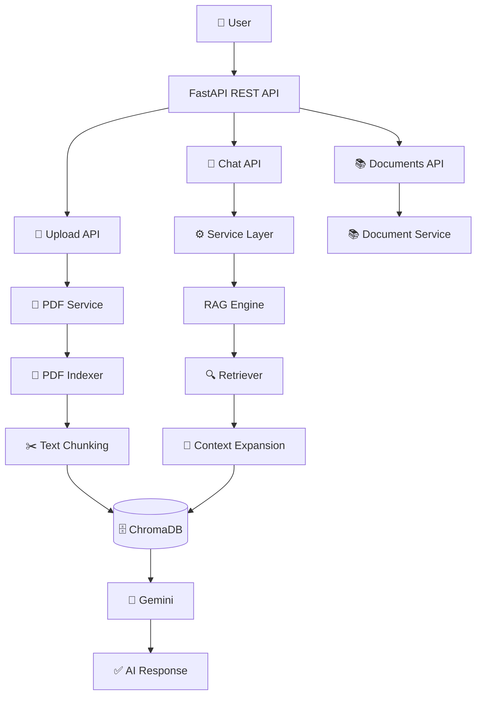

## 📊 Project Snapshot

| Metric | Value |
|---------|-------|
| Version | v0.8.0 |
| Development Status | Active |
| Language | Python 3.13 |
| Backend | FastAPI |
| LLM | Gemini 2.5 Flash |
| Vector Database | ChromaDB |
| Architecture | Modular RAG |
| License | MIT |

## 🎯 Why DocuMind AI?

Traditional chatbots cannot reliably answer questions about private documents because they lack access to the document's content.

DocuMind AI solves this by combining Retrieval-Augmented Generation (RAG), vector embeddings, and Large Language Models to produce grounded, document-aware answers while citing the relevant source chunks.

## ⭐ Highlights

- Production-oriented architecture
- FastAPI REST backend
- Retrieval-Augmented Generation (RAG)
- Semantic Search
- Context Expansion
- Source Citations
- Automatic PDF Indexing
- Multi-Document Support
- Document Management API
- Document-aware Retrieval
- Modular Services
- Clean Architecture
- Ready for Cloud Deployment

## 🧩 Core Components

| Module | Responsibility |
|----------|----------------|
| pdf_reader.py | Extract PDF text |
| text_chunker.py | Split documents |
| embeddings.py | Generate vector embeddings |
| vector_store.py | ChromaDB integration |
| retriever.py | Semantic search |
| context_expander.py | Improve retrieval context |
| rag.py | RAG orchestration |
| rag_service.py | Business logic |
| pdf_service.py | Upload & indexing pipeline |
| document_service.py | Document management |
| upload.py | Upload REST endpoint |
| documents.py | Documents REST endpoint |
| chat.py | Chat REST endpoint |

## 🏗 System Architecture

## ✨ Current Features

### 📄 Upload API

- Upload PDF documents
- Automatic validation
- Automatic indexing
- Embedding generation
- ChromaDB storage

### 💬 Chat API

- Ask questions across all indexed documents
- Restrict search to a specific document (optional)
- Source citations
- AI-generated grounded answers

### 📚 Documents API

- List all indexed documents
- Chunk count per document
- Human-readable document names
- Ready for frontend integration

## 📜 Version History

### v0.8.0

- Documents API
- Document Service
- Multi-document management
- Document-aware retrieval
- Automatic document indexing
- Input normalization
- Improved API documentation

### v0.7.0

- Upload API
- PDF Service
- Automatic Indexing
- File Validation

### v0.6.0

- FastAPI Backend
- Swagger UI
- REST API
- Service Layer
- Clean Architecture

### v0.5.0

- Context Expansion
- Improved Retrieval
- Prompt Refactoring

### v0.4.0

- ChromaDB
- Semantic Search

### v0.3.0

- Embedding Generation

### v0.2.0

- Text Chunking

### v0.1.0

- PDF Reader

## 🎯 Next Milestone (v0.9.0)

- Streamlit Frontend
- Chat Interface
- Upload Interface
- Document Dropdown
- Better User Experience

## 🎯 Future Milestones

- Authentication
- Conversation Memory
- Multi-user Workspace
- Streaming Responses
- Docker
- AWS Deployment
- CI/CD
- Monitoring
- Production Database

## 💼 What This Project Demonstrates

- AI Engineering
- Backend Development
- FastAPI
- REST APIs
- Service Layer Architecture
- Vector Databases
- Retrieval-Augmented Generation (RAG)
- Prompt Engineering
- Production API Design
- Software Architecture
- Git Workflow
- Production-Oriented Development

## 📚 Development Philosophy

DocuMind AI is intentionally built in incremental milestones.

Every feature is designed, implemented, tested, refactored, documented, and committed before moving to the next stage.

This mirrors how production software is developed in professional engineering teams.

---

## 🌟 Thank You

Thank you for taking the time to explore DocuMind AI.

This project represents an ongoing journey toward building production-ready AI systems with clean architecture, scalable backend engineering, and modern Large Language Models.

Every milestone focuses on writing maintainable, production-quality software rather than simply making features work.

Whether you're a recruiter, developer, or AI enthusiast, I hope this repository provides insight into both the engineering process and the evolution of an AI application from prototype to production.

If you find the project interesting:

⭐ Star the repository

🍴 Fork it

💬 Share feedback

🚀 Follow the journey

Happy Coding!

— Harsh More